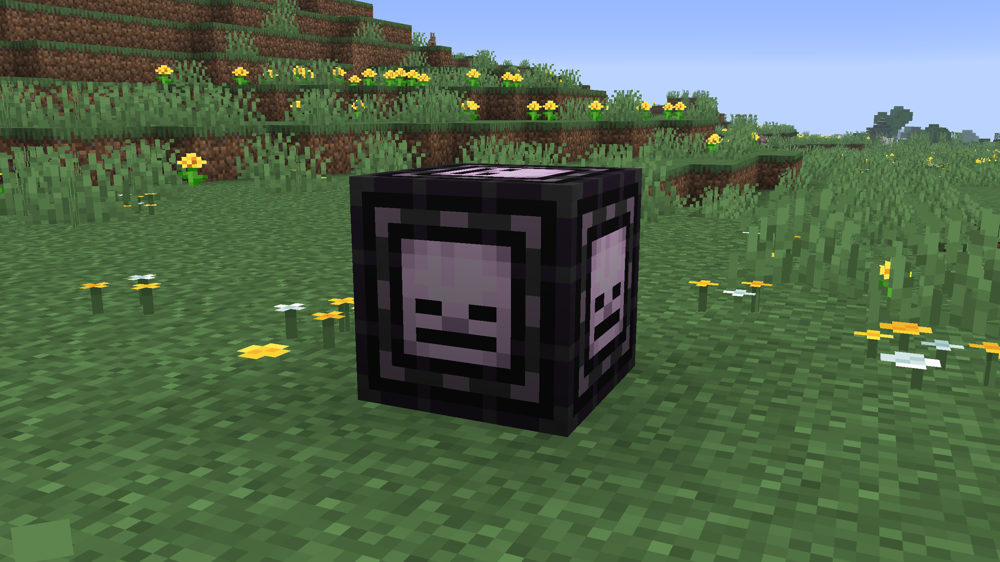
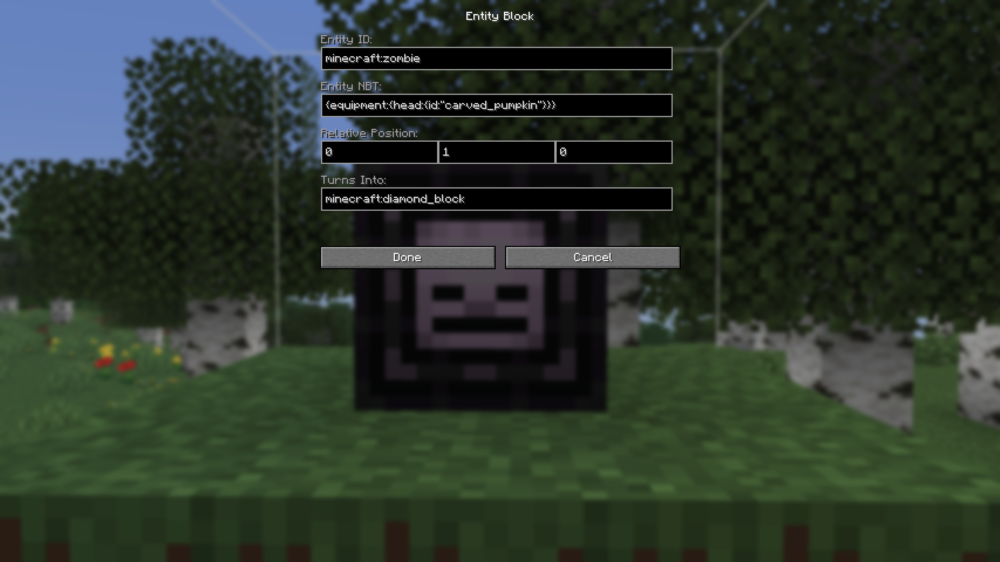
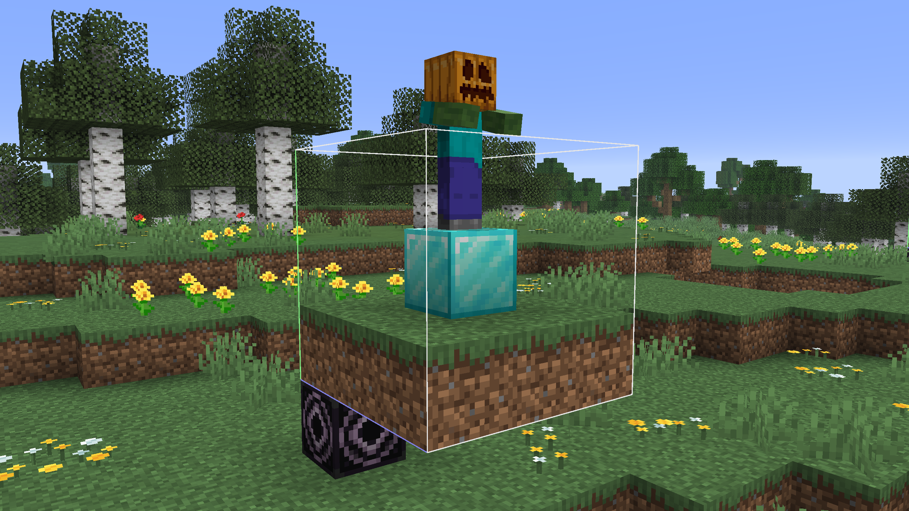

# Entity Block

[Modrinth Page](https://modrinth.com/mod/entity_block)

The Entity Block is a datapack/mod creation tool that makes adding entities to structures easier.

Entity blocks can be placed in custom structures to represent an entity,
similarly to how Structure Voids represent a block that should not be replaced.

When a structure with an entity block is saved, the entity block itself is not saved into the resulting nbt file.
Instead, an entity and the block specified in the 'Turns Into' field is saved instead.
This makes the structures usable in mods and datapacks without needing to have this mod as a dependency.

